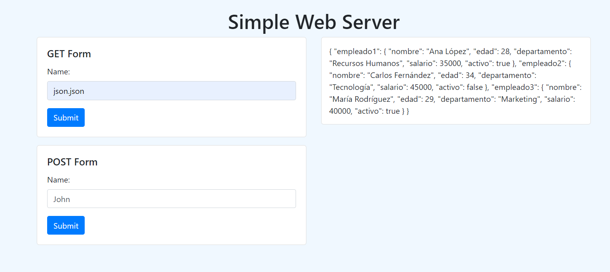
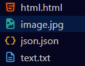

# SimpleWebServer

SimpleWebServer is a simple Java-based web server implementation that handles both HTTP GET and POST requests. The server serves static files and supports asynchronous communication with REST services.

## Key Features

- **GET and POST Request Handling**: Supports HTTP GET requests to serve static files and POST requests to receive and display data.
- **Static File Support**: Serves HTML, CSS, JS, and image files from a specific directory.
- **Asynchronous Communication with REST Services**: Performs asynchronous GET requests to external REST services and handles responses efficiently.

## Project Structure

### Main Classes

1. **SimpleWebServer.java**:
   - Main class that initializes the web server.
   - Sets up a thread pool to handle multiple concurrent connections.
   - Listens on the specified port and delegates request handling to `ClientHandler`.

2. **ClientHandler.java**:
   - Implements the `Runnable` interface to manage client communication.
   - Processes GET and POST requests, serving static files or responding to data sent by the client.
   - Handles asynchronous communication with REST services via the `RestClient` class.

3. **RestClient.java**:
   - Client for making asynchronous HTTP GET requests.
   - Uses `HttpClient` to send requests and handle responses asynchronously.

### Unit Tests

1. **RestClientTest.java**:
   - Unit tests for the `RestClient` class.
   - Verifies the behavior of the `sendAsyncGetRequest` method for successful and failed HTTP requests.
   - Uses Mockito to mock `HttpClient` responses and test the functionality of `RestClient`.

2. **SimpleWebServerTest.java**:
   - Unit tests for the `SimpleWebServer` class.
   - Verifies that the server can start correctly and accept connections.
   - Runs the server in a separate thread to avoid blocking test execution and checks the connection to port 8080.

## Architecture

1. **User Interaction**:
   - Users send HTTP requests to the server, which processes and responds according to the request type (GET or POST).

2. **Request Handling**:
   - The server uses a thread pool to handle multiple simultaneous connections.
   - GET requests serve static files or data from REST services.
   - POST requests receive and display data sent by the client.

3. **Asynchronous Communication**:
   - The `RestClient` class handles asynchronous GET requests to external services and manages responses.

## Installation and Execution

### Prerequisites

- Java Development Kit (JDK) 17 or higher

### Installation Steps

1. **Clone the Repository**:

   ```bash
   git clone https://github.com/JohannBulls/SimpleWebServer.git
   cd SimpleWebServer
   ```

2. **Compile the Project**:

   ```bash
   mvn clean install
   ```

3. **Run the Server**:

   ```bash
   mvn exec:java
   ```

4. **Access the Application**:
   - Open your web browser and go to `http://localhost:8080`.
   - You can access static files, perform POST requests, and view the received data.
     
   

5. **File examples**:
   - These are the example files that appear for the execution of the program.
     
   

### Running Unit Tests

To run unit tests, ensure you have JUnit and Mockito set up in your project. Then, execute the following commands:

1. **Compile the Tests**:

   ```bash
   mvn clean install
   ```

2. **Run the Tests**:

   ```bash
   mvn test
   ```

## Technologies Used

- **Java**: Primary programming language.
- **HttpClient**: For asynchronous communication with REST services.
- **ExecutorService**: For handling multiple concurrent requests.
- **JUnit**: For unit testing.
- **Mockito**: For mocking objects in unit tests.

## Author

- Johann Amaya Lopez - *JohannBulls* - [GitHub](https://github.com/JohannBulls)

## License

This project is licensed under the MIT License. See the [LICENSE](LICENSE.txt) file for details.
